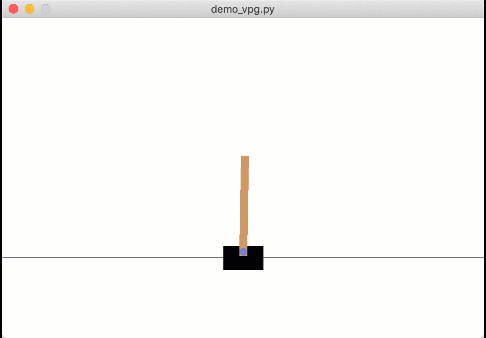

# Vanilla policy gradient algorithm in pytorch

## Introduction

This repository is a pytorch implementation of vanilla policy gradient used to solve
OpenAI's Cart-Pole gym environment.

## Getting Started

Make sure to have to have the following packages installed:
- [OpenAI gym](https://github.com/openai/gym)
- matplotlib
- numpy
- [pytorch](https://github.com/pytorch/pytorch)

Download the repository by clicking the green button labeled 'Clone or download' on this page. Alternatively, if you have git locally, you can clone at the terminal command line by using the command `git clone https://github.com/cjm715/deeprl-pytorch-cartpole.git`.

## Instructions

To see a demonstration of any algorithm run the command `python demo_vpg.py` from root of this repository. This will train an agent, save output files, and render the environment under control by the trained agent.
